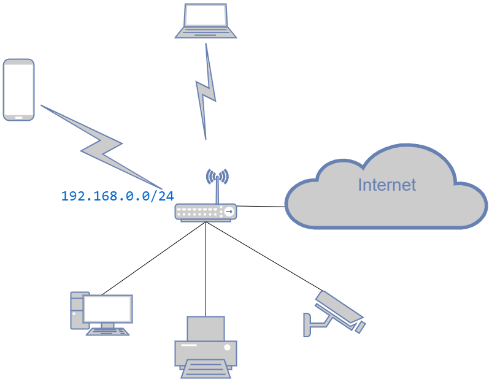

### Домашнее задание к занятию "3.8. Компьютерные сети, лекция 3"
1. Подключитесь к публичному маршрутизатору в интернет. Найдите маршрут к вашему публичному IP
```bash
route-views>show ip route 91.207.***.***

Routing entry for 91.207.170.0/23
  Known via "bgp 6447", distance 20, metric 0
  Tag 6939, type external
  Last update from 64.71.137.241 01:10:11 ago
  Routing Descriptor Blocks:
  * 64.71.137.241, from 64.71.137.241, 01:10:11 ago
      Route metric is 0, traffic share count is 1
      AS Hops 2
      Route tag 6939
      MPLS label: none
      
show bgp 91.207.***.***

Not advertised to any peer
  Refresh Epoch 1
  3333 15169
    193.0.0.56 from 193.0.0.56 (193.0.0.56)
Paths: (24 available, best #13, table default)
  Not advertised to any peer
  Refresh Epoch 1
  3333 1103 12714 29124, (aggregated by 29124 81.200.9.255)
    193.0.0.56 from 193.0.0.56 (193.0.0.56)
      Origin IGP, localpref 100, valid, external
      path 7FE031EC5A48 RPKI State valid
      rx pathid: 0, tx pathid: 0
  Refresh Epoch 1
  101 174 12714 29124, (aggregated by 29124 81.200.9.255)
    209.124.176.223 from 209.124.176.223 (209.124.176.223)
      Origin IGP, localpref 100, valid, external
      Community: 101:20100 101:20110 101:22100 174:21101 174:22005
      Extended Community: RT:101:22100
      path 7FE02F0EAB08 RPKI State valid
      rx pathid: 0, tx pathid: 0
  Refresh Epoch 1
  8283 1299 12714 29124, (aggregated by 29124 81.200.9.255)
    94.142.247.3 from 94.142.247.3 (94.142.247.3)
      Origin IGP, metric 0, localpref 100, valid, external
      Community: 1299:30000 8283:1 8283:101 8283:102
      unknown transitive attribute: flag 0xE0 type 0x20 length 0x24
        value 0000 205B 0000 0000 0000 0001 0000 205B
              0000 0005 0000 0001 0000 205B 0000 0005
              0000 0002
      path 7FE171161028 RPKI State valid
      rx pathid: 0, tx pathid: 0
  Refresh Epoch 1
  53767 174 12714 29124, (aggregated by 29124 81.200.9.255)
    162.251.163.2 from 162.251.163.2 (162.251.162.3)
      Origin IGP, localpref 100, valid, external
      Community: 174:21101 174:22005 53767:5000
      path 7FE0E22D1B28 RPKI State valid
      rx pathid: 0, tx pathid: 0
  Refresh Epoch 1
  3267 31133 12714 29124, (aggregated by 29124 81.200.9.255)
    194.85.40.15 from 194.85.40.15 (185.141.126.1)
      Origin IGP, metric 0, localpref 100, valid, external
      path 7FE0165E18D8 RPKI State valid
      rx pathid: 0, tx pathid: 0
  Refresh Epoch 1
  3561 3910 3356 3216 8595 29124, (aggregated by 29124 81.200.9.255)
    206.24.210.80 from 206.24.210.80 (206.24.210.80)      
```
2. Создайте dummy0 интерфейс в Ubuntu. Добавьте несколько статических маршрутов. Проверьте таблицу маршрутизации
```bash
stanislav@ubuntu:~$ lsmod | grep 'dummy'
dummy                  16384  0

stanislav@ubuntu:~$ ip -br a | grep 'dummy'
dummy0           UNKNOWN        10.2.2.2/32 fe80::286b:aeff:fe2e:f820/64

# Добавим 2 статических маршрута
stanislav@ubuntu:~$ sudo ip route add 188.114.99.0/24 via 10.0.2.2
stanislav@ubuntu:~$ sudo ip route add 10.0.2.3 dev enp0s3 src 10.0.2.15 metric 200
stanislav@ubuntu:~$ ip route
default via 10.0.2.2 dev enp0s3 proto dhcp src 10.0.2.15 metric 100
10.0.2.0/24 dev enp0s3 proto kernel scope link src 10.0.2.15
10.0.2.2 dev enp0s3 proto dhcp scope link src 10.0.2.15 metric 100
10.0.2.3 dev enp0s3 scope link src 10.0.2.15 metric 200
172.17.0.0/16 dev docker0 proto kernel scope link src 172.17.0.1 linkdown
188.114.99.0/24 via 10.0.2.2 dev enp0s3
```
3. Проверьте открытые TCP порты в Ubuntu, какие протоколы и приложения используют эти порты? Приведите несколько примеров.
```bash
# Единственным открытым tcp-соединением на моей VM, является мое подключение по SSH
stanislav@ubuntu:~$ ss -t
State                   Recv-Q                    Send-Q                                        Local Address:Port                                       Peer Address:Port
ESTAB                   0                         0                                                 10.0.2.15:ssh                                            10.0.2.2:64697
```
4. Проверьте используемые UDP сокеты в Ubuntu, какие протоколы и приложения используют эти порты?
```bash
# Открытых udp-соденинений нет
stanislav@ubuntu:~$ ss -u
Recv-Q                      Send-Q                                              Local Address:Port                                             Peer Address:Port

# Имеются закрытые соединения на портах 53 (DNS) и 68 (bootpc)
stanislav@ubuntu:~$ ss -ua
State                  Recv-Q                  Send-Q                                       Local Address:Port                                      Peer Address:Port
UNCONN                 0                       0                                            127.0.0.53%lo:domain                                         0.0.0.0:*
UNCONN                 0                       0                                         10.0.2.15%enp0s3:bootpc                                         0.0.0.0:*
```
5.Используя diagrams.net, создайте L3 диаграмму вашей домашней сети или любой другой сети, с которой вы работали.
>Диаграмма L3 домашней сети

6. nginx
```bash
stanislav@ubuntu:~/nginx$ cat nginx.conf

# Для целей тестирования был написан и запущен легкий socket-server, с двумя прослушиваемыми
# портами 9090 и 9091. В ответе возвращает номер порта на который прилетел запрос  
# В конфиге настроена балансировка транспортного уровня (stream)
events {}

stream {
  upstream tcp_balancer {
    server 10.0.2.2:9090;
    server 10.0.2.2:9091;
  }

  server {
    listen 7777;
    proxy_pass tcp_balancer;
  }
}

stanislav@ubuntu:~/nginx$ exec 3<>/dev/tcp/127.0.0.1/7777 && echo 'hello'>&3 && cat <&3
Response for [hello] from port 9090
stanislav@ubuntu:~/nginx$ exec 3<>/dev/tcp/127.0.0.1/7777 && echo 'hello'>&3 && cat <&3
Response for [hello] from port 9091
stanislav@ubuntu:~/nginx$ exec 3<>/dev/tcp/127.0.0.1/7777 && echo 'hello'>&3 && cat <&3
Response for [hello] from port 9090
stanislav@ubuntu:~/nginx$ exec 3<>/dev/tcp/127.0.0.1/7777 && echo 'hello'>&3 && cat <&3
Response for [hello] from port 9091
```