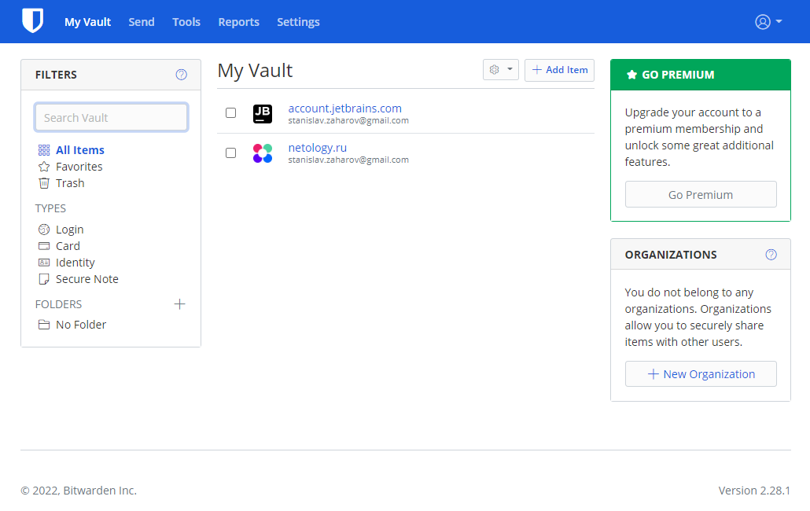
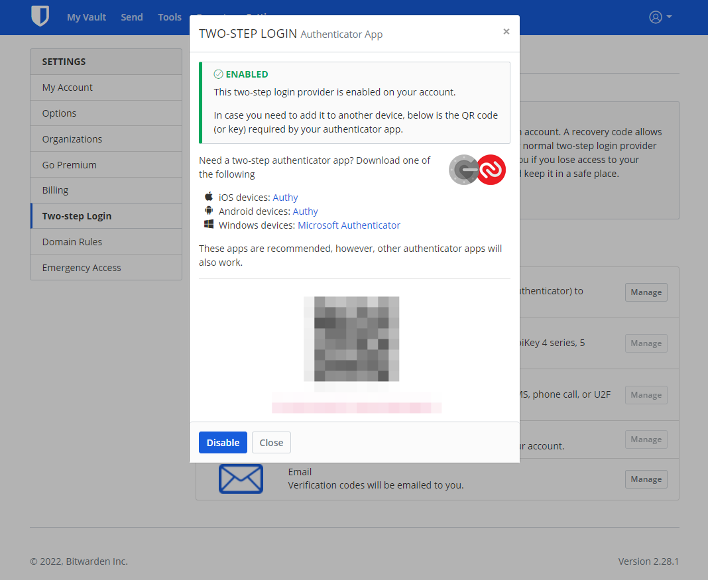
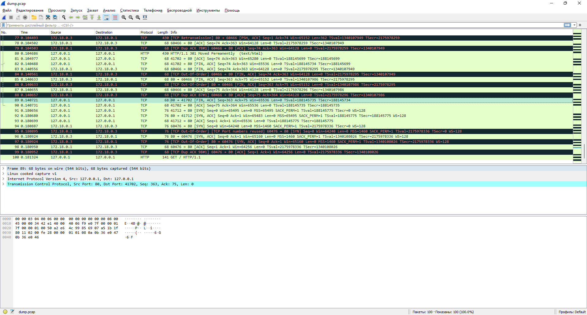

### Домашнее задание к занятию "3.9. Элементы безопасности информационных систем"
1. Установите Bitwarden плагин для браузера. Зарегестрируйтесь и сохраните несколько паролей.
    > 
2. Установите Google authenticator на мобильный телефон. Настройте вход в Bitwarden акаунт через Google authenticator OTP.
    >  "Снимок экрана к заданию 2"
3. Установите apache2, сгенерируйте самоподписанный сертификат, настройте тестовый сайт для работы по HTTPS.
   > Для реализации данного задания поднимем с помощью утилиты Netcat иммитацию http сервера, 
   > с прослушиваемым портом 8080 и отвечающим статикой. Закроем http server Nginx'ом, который в качестве reverse-proxy
   > слушает порты 80 и 443, с редиректом 80 -> 443. Listener для порта 443 поднимается с SSL контекстом

   > * Генерируем пару глючей
   >  ```bash
   >  stanislav@ubuntu:~/nginx$ sudo openssl req -x509 -nodes -days 365 -newkey rsa:2048 -keyout ./keys/cert.key -out ./keys/cert.crt -subj "/C=RU/ST=Moscow/L=Moscow/O=My Company/OU=Org/CN=localhost"
   >  Can't load /home/stanislav/.rnd into RNG
   >  140136796885440:error:2406F079:random number generator:RAND_load_file:Cannot open file:../crypto/rand/randfile.c:88:Filename=/home/stanislav/.rnd
   >  Generating a RSA private key
   >  .............+++++
   >  ........................................................+++++
   >  writing new private key to './keys/cert.key'
   >  -----
   >  ```
   > * Содержимое config'а Nginx
   >  ```bash
   >  stanislav@ubuntu:~/nginx$ cat nginx.conf
   >  events {}
   >  
   >  http {
   >  
   >    server {
   >        listen 80;
   >        return 301 https://$host$request_uri;
   >    }
   >  
   >    server {
   >  
   >        listen 443;
   >  
   >        ssl_certificate     /etc/nginx/cert.crt;
   >        ssl_certificate_key /etc/nginx/cert.key;
   >  
   >        ssl on;
   >        ssl_session_cache  builtin:1000  shared:SSL:10m;
   >        ssl_protocols  TLSv1 TLSv1.1 TLSv1.2;
   >        ssl_ciphers HIGH:!aNULL:!eNULL:!EXPORT:!CAMELLIA:!DES:!MD5:!PSK:!RC4;
   >        ssl_prefer_server_ciphers on;
   >  
   >        location / {
   >  
   >        proxy_set_header        Host $host;
   >        proxy_set_header        X-Real-IP $remote_addr;
   >        proxy_set_header        X-Forwarded-For $proxy_add_x_forwarded_for;
   >        proxy_set_header        X-Forwarded-Proto $scheme;
   >  
   >        proxy_pass          http://web-server:8080;
   >        proxy_read_timeout  90;
   >      }
   >    }
   >  }
   >  ```
   >  * Содержимое docker-compose.yml, где поднимается Nginx и псевдо http-server
   >  ```bash
   >  stanislav@ubuntu:~/nginx$ cat docker-compose.yml
   >  version: "3"
   >  
   >  services:
   >    nginx:
   >      image: nginx:1.21.6
   >      container_name: nginx
   >      ports:
   >        - 80:80
   >        - 443:443
   >      volumes:
   >        - ./nginx.conf:/etc/nginx/nginx.conf
   >        - ./keys/cert.key:/etc/nginx/cert.key
   >        - ./keys/cert.crt:/etc/nginx/cert.crt
   >      networks:
   >        - nginx_net
   >  
   >    web-server:
   >      image: busybox
   >      container_name: web-server
   >      entrypoint: sh -c "while true; do { echo -e 'HTTP/1.1 200 OK\r\n'; echo 'Hello from unsecured http server!'; } | nc -l -p  8080; done"
   >      networks:
   >        - nginx_net
   >  
   >  networks:
   >    nginx_net:
   >      driver: bridge       
   >  ```
   > * Поднимаем контейнеры
   >  ```bash
   >  stanislav@ubuntu:~/nginx$ docker-compose up -d
   >  Creating nginx      ... done
   >  Creating web-server ... done
   >  ```
   > * Выполняем http запрос на 80 порт прослушиваемый Nginx, где произойдет redirect на 443
   >  с поднятием SSL контекста, далее запрос будет проксирован в порт 8080 псевдо http-сервера
   >  ```bash
   >  stanislav@ubuntu:~/nginx$ curl -kvL http://localhost
   >  * Rebuilt URL to: http://localhost/
   >  *   Trying 127.0.0.1...
   >  * TCP_NODELAY set
   >  * Connected to localhost (127.0.0.1) port 80 (#0)
   >  > GET / HTTP/1.1
   >  > Host: localhost
   >  > User-Agent: curl/7.58.0
   >  > Accept: */*
   >  >
   >  < HTTP/1.1 301 Moved Permanently
   >  < Server: nginx/1.21.6
   >  < Date: Tue, 03 May 2022 13:19:59 GMT
   >  < Content-Type: text/html
   >  < Content-Length: 169
   >  < Connection: keep-alive
   >  < Location: https://localhost/
   >  <
   >  * Ignoring the response-body
   >  * Connection #0 to host localhost left intact
   >  * Clear auth, redirects to port from 80 to 443Issue another request to this URL: 'https://localhost/'
   >  *   Trying 127.0.0.1...
   >  * TCP_NODELAY set
   >  * Connected to localhost (127.0.0.1) port 443 (#1)
   >  * ALPN, offering h2
   >  * ALPN, offering http/1.1
   >  * successfully set certificate verify locations:
   >  *   CAfile: /etc/ssl/certs/ca-certificates.crt
     >  CApath: /etc/ssl/certs
   >  * TLSv1.3 (OUT), TLS handshake, Client hello (1):
   >  * TLSv1.3 (IN), TLS handshake, Server hello (2):
   >  * TLSv1.2 (IN), TLS handshake, Certificate (11):
   >  * TLSv1.2 (IN), TLS handshake, Server key exchange (12):
   >  * TLSv1.2 (IN), TLS handshake, Server finished (14):
   >  * TLSv1.2 (OUT), TLS handshake, Client key exchange (16):
   >  * TLSv1.2 (OUT), TLS change cipher, Client hello (1):
   >  * TLSv1.2 (OUT), TLS handshake, Finished (20):
   >  * TLSv1.2 (IN), TLS handshake, Finished (20):
   >  * SSL connection using TLSv1.2 / ECDHE-RSA-AES256-GCM-SHA384
   >  * ALPN, server accepted to use http/1.1
   >  * Server certificate:
   >  *  subject: C=RU; ST=Moscow; L=Moscow; O=My Company; OU=Org; CN=localhost
   >  *  start date: May  3 13:18:30 2022 GMT
   >  *  expire date: May  3 13:18:30 2023 GMT
   >  *  issuer: C=RU; ST=Moscow; L=Moscow; O=My Company; OU=Org; CN=localhost
   >  *  SSL certificate verify result: self signed certificate (18), continuing anyway.
   >  > GET / HTTP/1.1
   >  > Host: localhost
   >  > User-Agent: curl/7.58.0
   >  > Accept: */*
   >  >
   >  < HTTP/1.1 200 OK
   >  < Server: nginx/1.21.6
   >  < Date: Tue, 03 May 2022 13:19:59 GMT
   >  < Transfer-Encoding: chunked
   >  < Connection: keep-alive
   >  <
   >  Hello from unsecured http server!
   >  * Connection #1 to host localhost left intact
   >  ```
4. Проверьте на TLS уязвимости произвольный сайт в интернете (кроме сайтов МВД, ФСБ, МинОбр, НацБанк, РосКосмос, РосАтом, РосНАНО и любых госкомпаний, объектов КИИ, ВПК ... и тому подобное).
    ```bash
    stanislav@ubuntu:~/testssl.sh$ ./testssl.sh -U --sneaky https://netology.ru
    
    ###########################################################
        testssl.sh       3.1dev from https://testssl.sh/dev/
        (0329eba 2022-04-27 14:49:02 -- )
    
          This program is free software. Distribution and
                 modification under GPLv2 permitted.
          USAGE w/o ANY WARRANTY. USE IT AT YOUR OWN RISK!
    
           Please file bugs @ https://testssl.sh/bugs/
    
    ###########################################################
    
     Using "OpenSSL 1.0.2-chacha (1.0.2k-dev)" [~183 ciphers]
     on ubuntu:./bin/openssl.Linux.x86_64
     (built: "Jan 18 17:12:17 2019", platform: "linux-x86_64")
    
    
     Start 2022-05-03 14:21:19        -->> 188.114.99.128:443 (netology.ru) <<--
    
     Further IP addresses:   2a06:98c1:3120:8000::
     rDNS (188.114.99.128):  --
     Service detected:       HTTP
    
    
     Testing vulnerabilities
    
     Heartbleed (CVE-2014-0160)                not vulnerable (OK), no heartbeat extension
     CCS (CVE-2014-0224)                       not vulnerable (OK)
     Ticketbleed (CVE-2016-9244), experiment.  not vulnerable (OK), no session tickets
     ROBOT                                     not vulnerable (OK)
     Secure Renegotiation (RFC 5746)           OpenSSL handshake didn't succeed
     Secure Client-Initiated Renegotiation     not vulnerable (OK)
     CRIME, TLS (CVE-2012-4929)                not vulnerable (OK)
     BREACH (CVE-2013-3587)                    potentially NOT ok, "gzip" HTTP compression detected. - only supplied "/" tested
                                               Can be ignored for static pages or if no secrets in the page
     POODLE, SSL (CVE-2014-3566)               not vulnerable (OK)
     TLS_FALLBACK_SCSV (RFC 7507)              Downgrade attack prevention supported (OK)
     SWEET32 (CVE-2016-2183, CVE-2016-6329)    VULNERABLE, uses 64 bit block ciphers
     FREAK (CVE-2015-0204)                     not vulnerable (OK)
     DROWN (CVE-2016-0800, CVE-2016-0703)      not vulnerable on this host and port (OK)
                                               make sure you don't use this certificate elsewhere with SSLv2 enabled services
                                               https://censys.io/ipv4?q=A3C7D9A8D3805171D99EA61F5C80B8ADF49B93BA21EBB492D78512BA254E90A5 could help you to find out
     LOGJAM (CVE-2015-4000), experimental      not vulnerable (OK): no DH EXPORT ciphers, no DH key detected with <= TLS 1.2
     BEAST (CVE-2011-3389)                     TLS1: ECDHE-RSA-AES128-SHA AES128-SHA ECDHE-RSA-AES256-SHA AES256-SHA DES-CBC3-SHA
                                               VULNERABLE -- but also supports higher protocols  TLSv1.1 TLSv1.2 (likely mitigated)
     LUCKY13 (CVE-2013-0169), experimental     potentially VULNERABLE, uses cipher block chaining (CBC) ciphers with TLS. Check patches
     Winshock (CVE-2014-6321), experimental    not vulnerable (OK)
     RC4 (CVE-2013-2566, CVE-2015-2808)        no RC4 ciphers detected (OK)
    
    
     Done 2022-05-03 14:22:03 [  46s] -->> 188.114.99.128:443 (netology.ru) <<--
    ```
5. Установите на Ubuntu ssh сервер, сгенерируйте новый приватный ключ. Скопируйте свой публичный ключ на другой сервер. Подключитесь к серверу по SSH-ключу.
    * Оганизуем подключение с использованием ssh-ключей из под windows-клиента на Ubuntu
      (в Windows ключи уже были сгенерированы ранее)
    ```bash
    PS C:\Users\Stanislav> ls $env:USERPROFILE/.ssh
        Каталог: C:\Users\Stanislav\.ssh
    Mode                 LastWriteTime         Length Name
    ----                 -------------         ------ ----
    -a----        05.12.2021     21:16           2602 id_rsa
    -a----        05.12.2021     21:16            572 id_rsa.pub
    -a----        23.04.2022     22:33           2104 known_hosts    
    ```
   * Добавим публичный ключ в доверенные ключи аутентификации пользователя на стороне Ubuntu
   ```bash
    PS C:\Users\Stanislav> type $env:USERPROFILE/.ssh/id_rsa.pub | ssh stanislav@localhost -p 3022 'cat >> .ssh/authorized_keys'
    stanislav@localhost's password:   
   ```
   * Подключаемся без пары login/password
   ```bash
    PS C:\Users\Stanislav> ssh localhost -p 3022
    Welcome to Ubuntu 18.04.6 LTS (GNU/Linux 4.15.0-176-generic x86_64)
    stanislav@ubuntu:~$   
   ```
6. Переименуйте файлы ключей из задания 5. Настройте файл конфигурации SSH клиента, так чтобы вход на удаленный сервер осуществлялся по имени сервера.
    ```bash
    PS C:\Users\Stanislav> type $env:USERPROFILE/.ssh/config
    Host my-ubuntu
      HostName localhost
      IdentityFile ~/.ssh/my-ubuntu.key
      User stanislav
      Port 3022
      
    PS C:\Users\Stanislav> ssh my-ubuntu
    Welcome to Ubuntu 18.04.6 LTS (GNU/Linux 4.15.0-176-generic x86_64)
    stanislav@ubuntu:~$
    ```
7. Соберите дамп трафика утилитой tcpdump в формате pcap, 100 пакетов. Откройте файл pcap в Wireshark.
    ```bash
    stanislav@ubuntu:~$ sudo tcpdump -i any -c 100 port 80 -w dump.pcap
    tcpdump: listening on any, link-type LINUX_SLL (Linux cooked), capture size 262144 bytes
    
    stanislav@ubuntu:~$ for i in {1..5}; do curl -vkL http://localhost; done
    ```
   