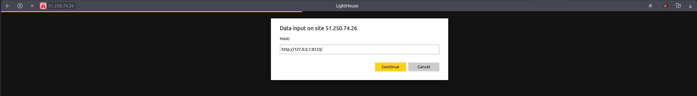
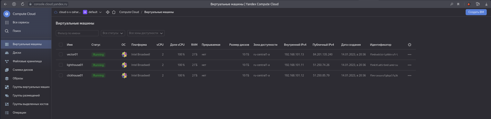

## Домашнее задание к занятию "3. Использование Yandex Cloud"
### Подготовка к выполнению
1. Подготовьте в Yandex Cloud три хоста: для clickhouse, для vector и для lighthouse.
  * Подготовка облачной инфраструктуры, а также воспроизведение [ansible playbook](./ansible/site.yml) произведены с помощью [terraform](./terraform/)

### Основная часть
  * [Playbook](./ansible/site.yml) доработан для установки `lighthouse`, где:
    - Задекларированы 2 play:
      - `Install NGINX`: Для установки NGINX c тремя задачами:
        - Установка `Extra Packages for Enterprise Linux (EPEL)` с помощью модуля `yum`
        - Установка `NGINX` с помощью модуля `yum`
        - Генерация базового файла конфигурации с помощью модуля `template`
        - 2 `handlers` для запуска NGINX и "перечитывания" конфигурации соответственно
      - `Install lighthouse`: Для установки Lighthouse c двумя задачами и одной предварительной задачей:
        - Предварительная задача для установки git в целевую систему
        - Установка `Lighthouse` путем клонирования из git-репозитория в целевую директорию с помощью модуля `git`
        - Генерация файла конфигурации NGINX для обслуживания статического ресурса `Lighthouse` с помощью модуля `template`
  * `Playbook` был воспроизведен в рамках применения конфигурации `Terraform`
    ```bash
    $ terraform apply

    Terraform used the selected providers to generate the following execution plan. Resource actions are indicated with the following symbols:
      + create

    Terraform will perform the following actions:

      # local_file.inventory will be created
      + resource "local_file" "inventory" {
          + content              = (known after apply)
          + directory_permission = "0777"
          + file_permission      = "0777"
          + filename             = "../ansible/inventory"
          + id                   = (known after apply)
        }

      # null_resource.deploy will be created
      + resource "null_resource" "deploy" {
          + id = (known after apply)
        }

      # null_resource.wait will be created
      + resource "null_resource" "wait" {
          + id = (known after apply)
        }

      # yandex_compute_instance.clickhouse01 will be created
      + resource "yandex_compute_instance" "clickhouse01" {
          + allow_stopping_for_update = true
          + created_at                = (known after apply)
          + folder_id                 = (known after apply)
          + fqdn                      = (known after apply)
          + hostname                  = "clickhouse01.netology.yc"
          + id                        = (known after apply)
          + metadata                  = {
              + "ssh-keys" = <<-EOT
                    centos:ssh-rsa AAAA***
                EOT
            }
          + name                      = "clickhouse01"
          + network_acceleration_type = "standard"
          + platform_id               = "standard-v1"
          + service_account_id        = (known after apply)
          + status                    = (known after apply)
          + zone                      = "ru-central1-a"

          + boot_disk {
              + auto_delete = true
              + device_name = (known after apply)
              + disk_id     = (known after apply)
              + mode        = (known after apply)

              + initialize_params {
                  + block_size  = (known after apply)
                  + description = (known after apply)
                  + image_id    = "fd8jvcoeij6u9se84dt5"
                  + name        = "root-clickhouse01"
                  + size        = 10
                  + snapshot_id = (known after apply)
                  + type        = "network-nvme"
                }
            }

          + metadata_options {
              + aws_v1_http_endpoint = (known after apply)
              + aws_v1_http_token    = (known after apply)
              + gce_http_endpoint    = (known after apply)
              + gce_http_token       = (known after apply)
            }

          + network_interface {
              + index              = (known after apply)
              + ip_address         = "192.168.101.12"
              + ipv4               = true
              + ipv6               = (known after apply)
              + ipv6_address       = (known after apply)
              + mac_address        = (known after apply)
              + nat                = true
              + nat_ip_address     = (known after apply)
              + nat_ip_version     = (known after apply)
              + security_group_ids = (known after apply)
              + subnet_id          = (known after apply)
            }

          + placement_policy {
              + host_affinity_rules = (known after apply)
              + placement_group_id  = (known after apply)
            }

          + resources {
              + core_fraction = 100
              + cores         = 2
              + memory        = 2
            }

          + scheduling_policy {
              + preemptible = (known after apply)
            }
        }

      # yandex_compute_instance.lighthouse01 will be created
      + resource "yandex_compute_instance" "lighthouse01" {
          + allow_stopping_for_update = true
          + created_at                = (known after apply)
          + folder_id                 = (known after apply)
          + fqdn                      = (known after apply)
          + hostname                  = "lighthouse01.netology.yc"
          + id                        = (known after apply)
          + metadata                  = {
              + "ssh-keys" = <<-EOT
                    centos:ssh-rsa AAA***
                EOT
            }
          + name                      = "lighthouse01"
          + network_acceleration_type = "standard"
          + platform_id               = "standard-v1"
          + service_account_id        = (known after apply)
          + status                    = (known after apply)
          + zone                      = "ru-central1-a"

          + boot_disk {
              + auto_delete = true
              + device_name = (known after apply)
              + disk_id     = (known after apply)
              + mode        = (known after apply)

              + initialize_params {
                  + block_size  = (known after apply)
                  + description = (known after apply)
                  + image_id    = "fd8jvcoeij6u9se84dt5"
                  + name        = "root-lighthouse01"
                  + size        = 10
                  + snapshot_id = (known after apply)
                  + type        = "network-nvme"
                }
            }

          + metadata_options {
              + aws_v1_http_endpoint = (known after apply)
              + aws_v1_http_token    = (known after apply)
              + gce_http_endpoint    = (known after apply)
              + gce_http_token       = (known after apply)
            }

          + network_interface {
              + index              = (known after apply)
              + ip_address         = "192.168.101.11"
              + ipv4               = true
              + ipv6               = (known after apply)
              + ipv6_address       = (known after apply)
              + mac_address        = (known after apply)
              + nat                = true
              + nat_ip_address     = (known after apply)
              + nat_ip_version     = (known after apply)
              + security_group_ids = (known after apply)
              + subnet_id          = (known after apply)
            }

          + placement_policy {
              + host_affinity_rules = (known after apply)
              + placement_group_id  = (known after apply)
            }

          + resources {
              + core_fraction = 100
              + cores         = 2
              + memory        = 2
            }

          + scheduling_policy {
              + preemptible = (known after apply)
            }
        }

      # yandex_compute_instance.vector01 will be created
      + resource "yandex_compute_instance" "vector01" {
          + allow_stopping_for_update = true
          + created_at                = (known after apply)
          + folder_id                 = (known after apply)
          + fqdn                      = (known after apply)
          + hostname                  = "vector01.netology.yc"
          + id                        = (known after apply)
          + metadata                  = {
              + "ssh-keys" = <<-EOT
                    centos:ssh-rsa AAA***
                EOT
            }
          + name                      = "vector01"
          + network_acceleration_type = "standard"
          + platform_id               = "standard-v1"
          + service_account_id        = (known after apply)
          + status                    = (known after apply)
          + zone                      = "ru-central1-a"

          + boot_disk {
              + auto_delete = true
              + device_name = (known after apply)
              + disk_id     = (known after apply)
              + mode        = (known after apply)

              + initialize_params {
                  + block_size  = (known after apply)
                  + description = (known after apply)
                  + image_id    = "fd8jvcoeij6u9se84dt5"
                  + name        = "root-vector01"
                  + size        = 10
                  + snapshot_id = (known after apply)
                  + type        = "network-nvme"
                }
            }

          + metadata_options {
              + aws_v1_http_endpoint = (known after apply)
              + aws_v1_http_token    = (known after apply)
              + gce_http_endpoint    = (known after apply)
              + gce_http_token       = (known after apply)
            }

          + network_interface {
              + index              = (known after apply)
              + ip_address         = "192.168.101.13"
              + ipv4               = true
              + ipv6               = (known after apply)
              + ipv6_address       = (known after apply)
              + mac_address        = (known after apply)
              + nat                = true
              + nat_ip_address     = (known after apply)
              + nat_ip_version     = (known after apply)
              + security_group_ids = (known after apply)
              + subnet_id          = (known after apply)
            }

          + placement_policy {
              + host_affinity_rules = (known after apply)
              + placement_group_id  = (known after apply)
            }

          + resources {
              + core_fraction = 100
              + cores         = 2
              + memory        = 2
            }

          + scheduling_policy {
              + preemptible = (known after apply)
            }
        }

      # yandex_vpc_network.default will be created
      + resource "yandex_vpc_network" "default" {
          + created_at                = (known after apply)
          + default_security_group_id = (known after apply)
          + folder_id                 = (known after apply)
          + id                        = (known after apply)
          + labels                    = (known after apply)
          + name                      = "net"
          + subnet_ids                = (known after apply)
        }

      # yandex_vpc_subnet.default will be created
      + resource "yandex_vpc_subnet" "default" {
          + created_at     = (known after apply)
          + folder_id      = (known after apply)
          + id             = (known after apply)
          + labels         = (known after apply)
          + name           = "subnet"
          + network_id     = (known after apply)
          + v4_cidr_blocks = [
              + "192.168.101.0/24",
            ]
          + v6_cidr_blocks = (known after apply)
          + zone           = "ru-central1-a"
        }

    Plan: 8 to add, 0 to change, 0 to destroy.

    Do you want to perform these actions?
      Terraform will perform the actions described above.
      Only 'yes' will be accepted to approve.

      Enter a value: yes

    yandex_vpc_network.default: Creating...
    yandex_vpc_network.default: Creation complete after 2s [id=enp7mngvrut031707cjn]
    yandex_vpc_subnet.default: Creating...
    yandex_vpc_subnet.default: Creation complete after 1s [id=e9bh99k12fjin7slcfuf]
    yandex_compute_instance.vector01: Creating...
    yandex_compute_instance.clickhouse01: Creating...
    yandex_compute_instance.lighthouse01: Creating...
    yandex_compute_instance.clickhouse01: Still creating... [10s elapsed]
    yandex_compute_instance.vector01: Still creating... [10s elapsed]
    yandex_compute_instance.lighthouse01: Still creating... [10s elapsed]
    yandex_compute_instance.clickhouse01: Still creating... [20s elapsed]
    yandex_compute_instance.vector01: Still creating... [20s elapsed]
    yandex_compute_instance.lighthouse01: Still creating... [20s elapsed]
    yandex_compute_instance.clickhouse01: Still creating... [30s elapsed]
    yandex_compute_instance.vector01: Still creating... [30s elapsed]
    yandex_compute_instance.lighthouse01: Still creating... [30s elapsed]
    yandex_compute_instance.vector01: Creation complete after 34s [id=fhm8vebi6rip9bhrufri]
    yandex_compute_instance.clickhouse01: Creation complete after 34s [id=fhmrceuuvsfg8qalfq3k]
    yandex_compute_instance.lighthouse01: Creation complete after 36s [id=fhmk9ia05rbm6iam6rsu]
    local_file.inventory: Creating...
    local_file.inventory: Creation complete after 0s [id=34079b30308a5e5e88b8db165423cba9edb4fa21]
    null_resource.wait: Creating...
    null_resource.wait: Provisioning with 'local-exec'...
    null_resource.wait (local-exec): Executing: ["/bin/sh" "-c" "sleep 60"]
    null_resource.wait: Still creating... [10s elapsed]
    null_resource.wait: Still creating... [20s elapsed]
    null_resource.wait: Still creating... [30s elapsed]
    null_resource.wait: Still creating... [40s elapsed]
    null_resource.wait: Still creating... [50s elapsed]
    null_resource.wait: Still creating... [1m0s elapsed]
    null_resource.wait: Creation complete after 1m0s [id=6940585218576726126]
    null_resource.deploy: Creating...
    null_resource.deploy: Provisioning with 'local-exec'...
    null_resource.deploy (local-exec): Executing: ["/bin/sh" "-c" "ANSIBLE_FORCE_COLOR=1 ansible-playbook -i ../ansible/inventory ../ansible/site.yml"]

    null_resource.deploy (local-exec): PLAY [Install NGINX] ***********************************************************

    null_resource.deploy (local-exec): TASK [Gathering Facts] *********************************************************
    null_resource.deploy (local-exec): ok: [lighthouse01]

    null_resource.deploy (local-exec): TASK [NGINX | Install epel-release] ********************************************
    null_resource.deploy: Still creating... [10s elapsed]
    null_resource.deploy: Still creating... [20s elapsed]
    null_resource.deploy: Still creating... [30s elapsed]
    null_resource.deploy (local-exec): changed: [lighthouse01]

    null_resource.deploy (local-exec): TASK [NGINX | Install NGINX] ***************************************************
    null_resource.deploy: Still creating... [40s elapsed]
    null_resource.deploy (local-exec): changed: [lighthouse01]

    null_resource.deploy (local-exec): TASK [NGINX | Create general config] *******************************************
    null_resource.deploy: Still creating... [50s elapsed]
    null_resource.deploy (local-exec): changed: [lighthouse01]

    null_resource.deploy (local-exec): RUNNING HANDLER [start-nginx] **************************************************
    null_resource.deploy (local-exec): changed: [lighthouse01]

    null_resource.deploy (local-exec): RUNNING HANDLER [reload-nginx] *************************************************
    null_resource.deploy: Still creating... [1m0s elapsed]
    null_resource.deploy (local-exec): changed: [lighthouse01]

    null_resource.deploy (local-exec): PLAY [Install lighthouse] ******************************************************

    null_resource.deploy (local-exec): TASK [Gathering Facts] *********************************************************
    null_resource.deploy (local-exec): ok: [lighthouse01]

    null_resource.deploy (local-exec): TASK [Lighthouse | install dependencies] ***************************************
    null_resource.deploy: Still creating... [1m10s elapsed]
    null_resource.deploy: Still creating... [1m20s elapsed]
    null_resource.deploy (local-exec): changed: [lighthouse01]

    null_resource.deploy (local-exec): TASK [Lighthouse | Copy from git] **********************************************
    null_resource.deploy: Still creating... [1m30s elapsed]
    null_resource.deploy (local-exec): changed: [lighthouse01]

    null_resource.deploy (local-exec): TASK [Lighthouse | Create lighthouse config] ***********************************
    null_resource.deploy (local-exec): changed: [lighthouse01]

    null_resource.deploy (local-exec): RUNNING HANDLER [reload-nginx] *************************************************
    null_resource.deploy (local-exec): changed: [lighthouse01]

    null_resource.deploy (local-exec): PLAY [Install Clickhouse] ******************************************************

    null_resource.deploy (local-exec): TASK [Gathering Facts] *********************************************************
    null_resource.deploy: Still creating... [1m40s elapsed]
    null_resource.deploy (local-exec): ok: [clickhouse01]

    null_resource.deploy (local-exec): TASK [Get clickhouse distrib] **************************************************
    null_resource.deploy (local-exec): changed: [clickhouse01] => (item=clickhouse-client)
    null_resource.deploy (local-exec): changed: [clickhouse01] => (item=clickhouse-server)
    null_resource.deploy: Still creating... [1m50s elapsed]
    null_resource.deploy (local-exec): failed: [clickhouse01] (item=clickhouse-common-static) => {"ansible_loop_var": "item", "changed": false, "dest": "./clickhouse-common-static-22.3.3.44.rpm", "elapsed": 0, "item": "clickhouse-common-static", "msg": "Request failed", "response": "HTTP Error 404: Not Found", "status_code": 404, "url": "https://packages.clickhouse.com/rpm/stable/clickhouse-common-static-22.3.3.44.noarch.rpm"}

    null_resource.deploy (local-exec): TASK [Get clickhouse distrib] **************************************************
    null_resource.deploy (local-exec): changed: [clickhouse01]

    null_resource.deploy (local-exec): TASK [Install clickhouse packages] *********************************************
    null_resource.deploy: Still creating... [2m0s elapsed]
    null_resource.deploy: Still creating... [2m10s elapsed]
    null_resource.deploy: Still creating... [2m20s elapsed]
    null_resource.deploy: Still creating... [2m30s elapsed]
    null_resource.deploy: Still creating... [2m40s elapsed]
    null_resource.deploy: Still creating... [2m50s elapsed]
    null_resource.deploy: Still creating... [3m0s elapsed]
    null_resource.deploy: Still creating... [3m10s elapsed]
    null_resource.deploy (local-exec): changed: [clickhouse01]

    null_resource.deploy (local-exec): TASK [Start clickhouse service] ************************************************
    null_resource.deploy (local-exec): changed: [clickhouse01]

    null_resource.deploy (local-exec): TASK [Create database] *********************************************************
    null_resource.deploy (local-exec): changed: [clickhouse01]

    null_resource.deploy (local-exec): PLAY [Vector Install] **********************************************************

    null_resource.deploy (local-exec): TASK [Gathering Facts] *********************************************************
    null_resource.deploy: Still creating... [3m20s elapsed]
    null_resource.deploy (local-exec): ok: [vector01]

    null_resource.deploy (local-exec): TASK [Get vector distrib] ******************************************************
    null_resource.deploy (local-exec): changed: [vector01]

    null_resource.deploy (local-exec): TASK [Install Vector packages] *************************************************
    null_resource.deploy: Still creating... [3m30s elapsed]
    null_resource.deploy: Still creating... [3m40s elapsed]
    null_resource.deploy (local-exec): changed: [vector01]

    null_resource.deploy (local-exec): PLAY RECAP *********************************************************************
    null_resource.deploy (local-exec): clickhouse01               : ok=5    changed=4    unreachable=0    failed=0    skipped=0    rescued=1    ignored=0
    null_resource.deploy (local-exec): lighthouse01               : ok=11   changed=9    unreachable=0    failed=0    skipped=0    rescued=0    ignored=0
    null_resource.deploy (local-exec): vector01                   : ok=3    changed=2    unreachable=0    failed=0    skipped=0    rescued=0    ignored=0

    null_resource.deploy: Creation complete after 3m50s [id=8989685276589722696]
    ```
  * Убедитесь, что изменения на системе произведены
    ```bash
    $ ssh centos@51.250.85.79 "clickhouse-client --version"
    ClickHouse client version 22.3.3.44 (official build).

    $ ssh centos@84.201.135.240 "vector --version"
    vector 0.22.3 (x86_64-unknown-linux-gnu)
    ```
    - Lighthouse browser screenshot
    
    - Yandex cloud VM's screenshot
    
  * Убедитесь, что playbook идемпотентен
    ```bash
    ansible-playbook -i inventory site.yml --diff

    PLAY [Install NGINX] *****************************************************************************************************************************************

    TASK [Gathering Facts] ***************************************************************************************************************************************
    ok: [lighthouse01]

    TASK [NGINX | Install epel-release] **************************************************************************************************************************
    ok: [lighthouse01]

    TASK [NGINX | Install NGINX] *********************************************************************************************************************************
    ok: [lighthouse01]

    TASK [NGINX | Create general config] *************************************************************************************************************************
    ok: [lighthouse01]

    PLAY [Install lighthouse] ************************************************************************************************************************************

    TASK [Gathering Facts] ***************************************************************************************************************************************
    ok: [lighthouse01]

    TASK [Lighthouse | install dependencies] *********************************************************************************************************************
    ok: [lighthouse01]

    TASK [Lighthouse | Copy from git] ****************************************************************************************************************************
    ok: [lighthouse01]

    TASK [Lighthouse | Create lighthouse config] *****************************************************************************************************************
    ok: [lighthouse01]

    PLAY [Install Clickhouse] ************************************************************************************************************************************

    TASK [Gathering Facts] ***************************************************************************************************************************************
    ok: [clickhouse01]

    TASK [Get clickhouse distrib] ********************************************************************************************************************************
    ok: [clickhouse01] => (item=clickhouse-client)
    ok: [clickhouse01] => (item=clickhouse-server)
    failed: [clickhouse01] (item=clickhouse-common-static) => {"ansible_loop_var": "item", "changed": false, "dest": "./clickhouse-common-static-22.3.3.44.rpm", "elapsed": 0, "gid": 1000, "group": "centos", "item": "clickhouse-common-static", "mode": "0664", "msg": "Request failed", "owner": "centos", "response": "HTTP Error 404: Not Found", "secontext": "unconfined_u:object_r:user_home_t:s0", "size": 246310036, "state": "file", "status_code": 404, "uid": 1000, "url": "https://packages.clickhouse.com/rpm/stable/clickhouse-common-static-22.3.3.44.noarch.rpm"}

    TASK [Get clickhouse distrib] ********************************************************************************************************************************
    ok: [clickhouse01]

    TASK [Install clickhouse packages] ***************************************************************************************************************************
    ok: [clickhouse01]

    TASK [Start clickhouse service] ******************************************************************************************************************************
    ok: [clickhouse01]

    TASK [Create database] ***************************************************************************************************************************************
    ok: [clickhouse01]

    PLAY [Vector Install] ****************************************************************************************************************************************

    TASK [Gathering Facts] ***************************************************************************************************************************************
    ok: [vector01]

    TASK [Get vector distrib] ************************************************************************************************************************************
    ok: [vector01]

    TASK [Install Vector packages] *******************************************************************************************************************************
    ok: [vector01]

    PLAY RECAP ***************************************************************************************************************************************************
    clickhouse01               : ok=5    changed=0    unreachable=0    failed=0    skipped=0    rescued=1    ignored=0   
    lighthouse01               : ok=8    changed=0    unreachable=0    failed=0    skipped=0    rescued=0    ignored=0   
    vector01                   : ok=3    changed=0    unreachable=0    failed=0    skipped=0    rescued=0    ignored=0
    ```
