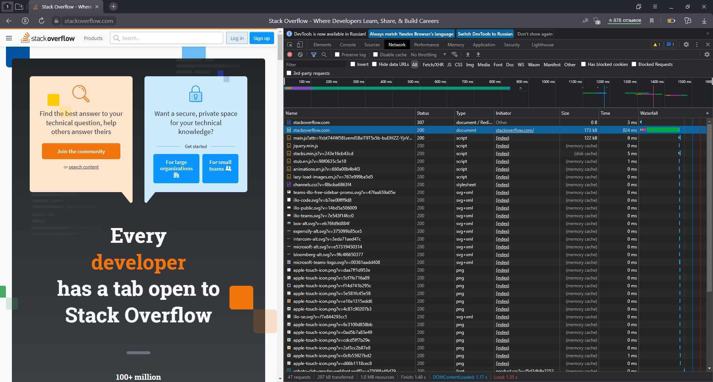
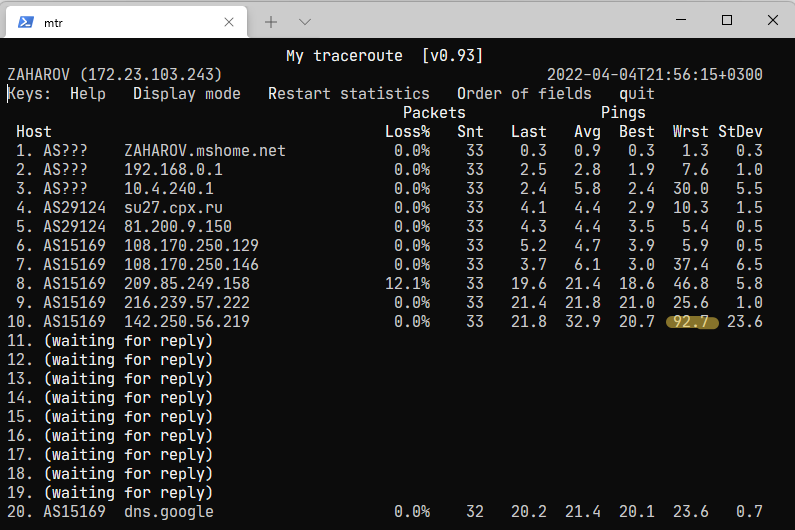

1. Работа c HTTP через телнет.
> В ответ на `telnet stackoverflow.com 80` получили http.status - 301  
> Это означает, что запрос должен быть перенаправлен на другой ресурс, который указан в заголовке ответа `Location`, 
> в нашем случае  https://stackoverflow.com/questions, по сути требование redirect'а на https...
2. Повторите задание 1 в браузере, используя консоль разработчика F12.
> Статус первого ответа - 307 (обычно - "Временно перемещен"), что говорит о необходимости перенаправить запрос
> в URL, указанный в заголовке `Location`, но последующие запросы отправлять в оригинальный (Это если академически
> подходить к вопросу :) )  
> Дольше всего производилась загрузка статического контента с https://stackoverflow.com/  
> 
> 
3. Какой IP адрес у вас в интернете?
```bash
$ dig +short myip.opendns.com @resolver1.opendns.com
91.***.***.*** 
```
4. Какому провайдеру принадлежит ваш IP адрес? Какой автономной системе AS? Воспользуйтесь утилитой whois
> IP принадлежит: Iskratelecom CJSC  
> Автономная система: AS29124
5. Через какие сети проходит пакет, отправленный с вашего компьютера на адрес 8.8.8.8? Через какие AS? Воспользуйтесь утилитой `traceroute`
```bash
$ traceroute -A 8.8.8.8
traceroute to 8.8.8.8 (8.8.8.8), 30 hops max, 60 byte packets
 1  ZAHAROV.mshome.net (172.23.96.1) [*]  0.387 ms  0.346 ms  0.332 ms
 2  192.168.0.1 (192.168.0.1) [*]  2.406 ms  2.811 ms  2.796 ms
 3  10.4.240.1 (10.4.240.1) [*]  4.760 ms  4.729 ms  4.637 ms
 4  * * *
 5  81.200.9.150 (81.200.9.150) [AS29124]  6.073 ms  6.059 ms  6.047 ms
 6  * * *
 7  108.170.250.129 (108.170.250.129) [AS15169]  5.155 ms  5.130 ms 108.170.250.33 (108.170.250.33) [AS15169]  5.493 ms
 8  108.170.250.130 (108.170.250.130) [AS15169]  5.362 ms 108.170.250.99 (108.170.250.99) [AS15169]  5.992 ms 108.170.250.130 (108.170.250.130) [AS15169]  4.879 ms
 9  * 209.85.249.158 (209.85.249.158) [AS15169]  22.054 ms *
10  142.250.235.62 (142.250.235.62) [AS15169]  21.204 ms 142.251.238.72 (142.251.238.72) [AS15169]  23.714 ms 142.250.235.68 (142.250.235.68) [AS15169]  21.946 ms
11  72.14.235.193 (72.14.235.193) [AS15169]  22.901 ms 216.239.49.3 (216.239.49.3) [AS15169]  23.988 ms 216.239.57.229 (216.239.57.229) [AS15169]  19.088 ms
12  * * *
13  * * *
14  * * *
15  * * *
16  * * *
17  * * *
18  * * *
19  * * *
20  * * *
21  dns.google (8.8.8.8) [AS15169]  25.493 ms * *
```
6. Повторите задание 5 в утилите `mtr`. На каком участке наибольшая задержка - delay?
```
Наиольшая задержка на 9-ом шаге
```

7. Какие DNS сервера отвечают за доменное имя dns.google? Какие A записи? воспользуйтесь утилитой `dig`
```bash
$ dig +trace dns.google
# DNS-сервера
dns.google.             10800   IN      NS      ns4.zdns.google.
dns.google.             10800   IN      NS      ns1.zdns.google.
dns.google.             10800   IN      NS      ns2.zdns.google.
dns.google.             10800   IN      NS      ns3.zdns.google.
# A-записи
dns.google.             900     IN      A       8.8.8.8
dns.google.             900     IN      A       8.8.4.4
```
8. Проверьте PTR записи для IP адресов из задания 7. Какое доменное имя привязано к IP? воспользуйтесь утилитой `dig`
```bash
$ dig -x 8.8.8.8
;; ANSWER SECTION:
8.8.8.8.in-addr.arpa.   0       IN      PTR     dns.google.

$ dig -x 8.8.4.4
;; ANSWER SECTION:
4.4.8.8.in-addr.arpa.   0       IN      PTR     dns.google.
```